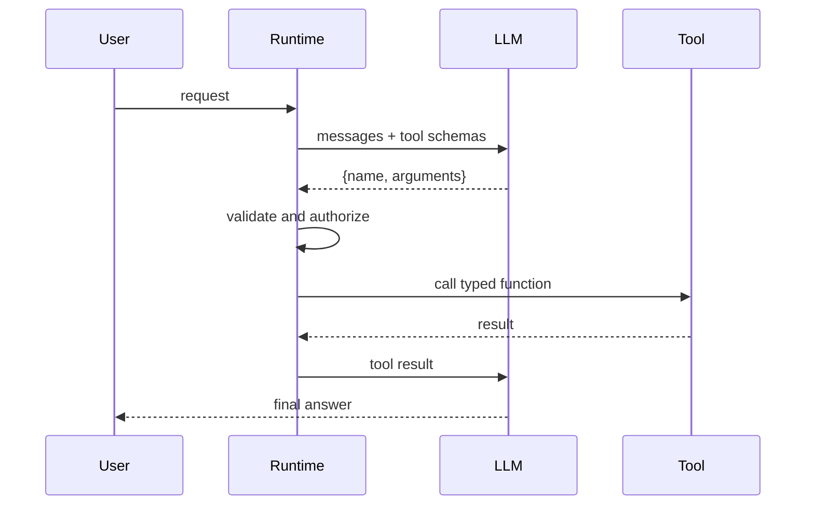

# Tool calling

LLMs do not directly execute tools. They generate structured tool-call requests. The runtime validates and executes tools, then returns results to the model.



```python
request = ToolCall.model_validate_json(model_text)
result = registry.execute(request.name, request.arguments)
messages.append({"role": "tool", "content": result.model_dump_json()})
```
Validation must cover tool allowlists, argument schemas, permissions, timeouts, and result size.
