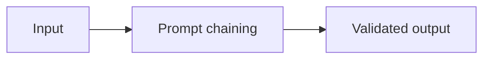
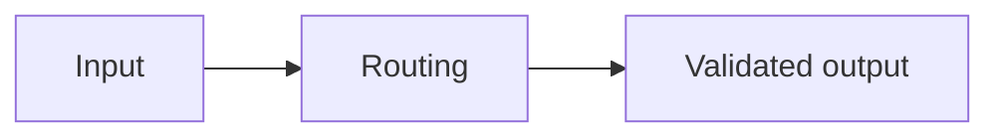
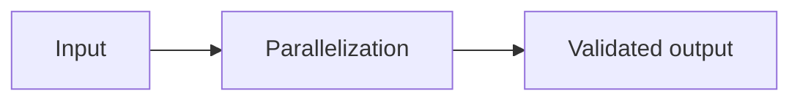
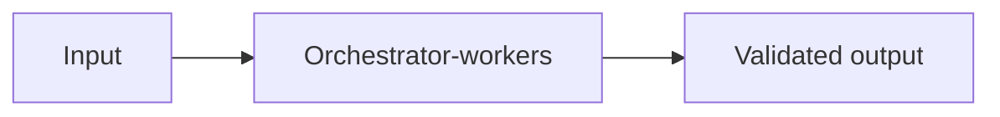
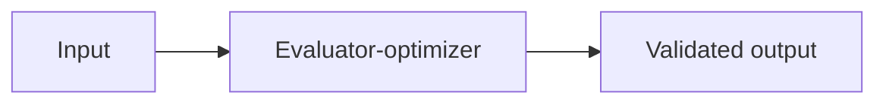

# Workflow patterns

A workflow has mostly code-defined control flow. An agentic system delegates more path selection to the model.

## Prompt chaining

**Definition:** Each model call feeds the next fixed step.



**Use case:** Draft then classify then polish.

```python
draft = llm(task); checked = llm(draft); return llm(checked)
```

**Failure mode:** Errors compound across steps.

**Exercise:** Add validation, a budget, and an observable event to this pattern.

## Routing

**Definition:** A classifier chooses one predefined branch.



**Use case:** Support ticket triage.

```python
route = classify(ticket); return handlers[route](ticket)
```

**Failure mode:** Misrouting can hide the right specialist.

**Exercise:** Add validation, a budget, and an observable event to this pattern.

## Parallelization

**Definition:** Independent calls run concurrently and are combined.



**Use case:** Analyze several documents.

```python
parts = await gather(*(analyze(x) for x in docs))
```

**Failure mode:** Rate limits and inconsistent outputs.

**Exercise:** Add validation, a budget, and an observable event to this pattern.

## Orchestrator-workers

**Definition:** An orchestrator decomposes work for specialized workers.



**Use case:** Research a multi-part question.

```python
jobs = plan(task); results = run_workers(jobs); return synthesize(results)
```

**Failure mode:** The plan may omit necessary work.

**Exercise:** Add validation, a budget, and an observable event to this pattern.

## Evaluator-optimizer

**Definition:** An evaluator critiques output until it passes or a limit is reached.



**Use case:** Improve a policy-safe answer.

```python
for _ in range(3): draft = improve(draft, evaluate(draft))
```

**Failure mode:** Unbounded loops waste tokens.

**Exercise:** Add validation, a budget, and an observable event to this pattern.
